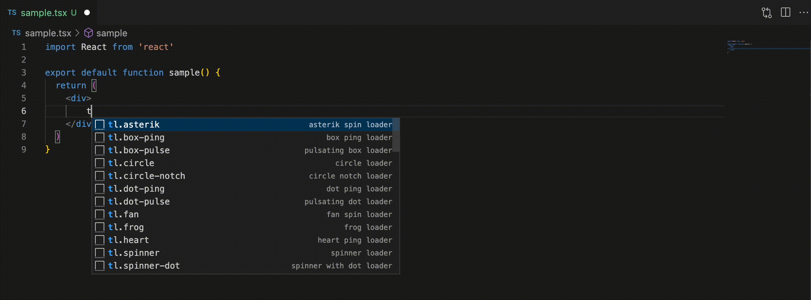
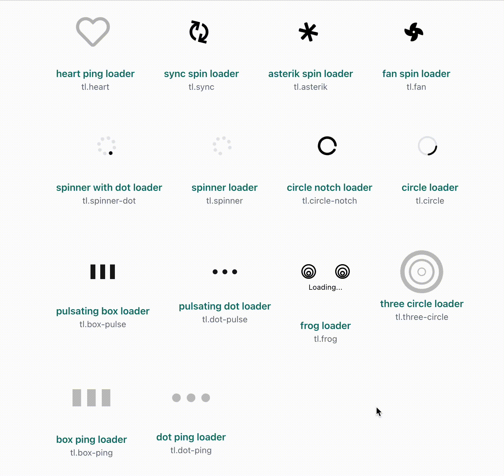

# Tailwind CSS Loaders 
## Code snippets for loaders/spinner written using tailwindcss
---

This extension contains code snippets for loaders/spinners in tailwindcss syntax for Vs Code editor (supports JavaScript,JSX,TSX, HTML, and TypeScript).

### Note
All the snippets has prefix of tl - to remember this, this is made from abbrevation **T**ailwind **L**oader.

### Usage
You must type tl.loader-name and choose the appropriate loader from the popup in order to utilise this extension. After choosing a loader, the code will be filled in according to that choice. By altering the tailwind classes, you can vary the colour of loaders.

### Supported languages (file extensions)
1. JavaScript (.js)
2. TypeScript (.ts)
3. JavaScript React (.jsx)
4. TypeScript React (.tsx)
5. Html (.html)

### Snippets
Below is a list of all available snippets and the triggers of each one.

| Prefix | Description |
| ----------- | ----------- |
| `tl.heart` | Heart shaped pinging effect loader |
| `tl.sync` | Sync icon spinner |
| `tl.asterik` | Asterik icon spinner |
| `tl.fan` | Fan icon spinner |
| `tl.spinner-dot` | spinner with a dot indicator |
| `tl.spinner`| basic spinner |
| `tl.circle` | basic circle spinner |
| `tl.circle-notch` | circle with a notch spinner |
| `tl.box-pulse` | box based pulsating loader |
| `tl.dot-pulse` | dot based pulsating loader |
| `tl.frog` | Frog shaped loader |
| `tl.three-circle` | three circle pinging effect loader |
| `tl.box-ping` | box pinging loader |
| `tl.dot-ping` | dot pinging loader |